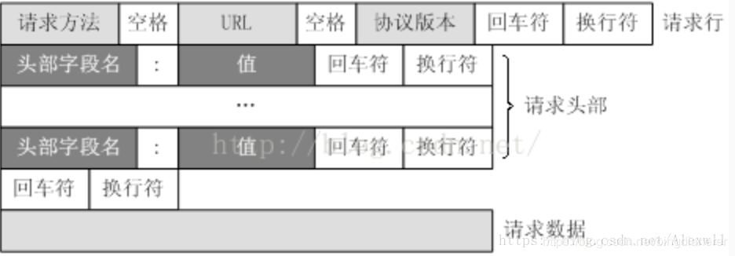
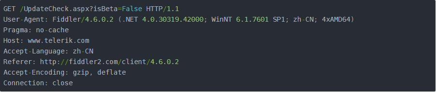

## 浅谈http协议

- 什么是 `http` 协议？`http` 传输的优缺点?

  1. **HTTP协议是超文本传输协议的缩写**，英文是Hyper Text Transfer Protocol。是从万维网服务器传输超文本到本地浏览器的传送协议。
  2. **HTTP是基于TCP/IP通信协议来传递数据的**，HTML 文件, 图片文件, 查询结果的请求应答协议。
  3. **无连接** 限制每次连接只处理一个请求。服务器处理完请求，并收到客户的应答后，即断开连接。采用这种方式可以节省传输时间。
  4. **无状态** 无状态是指协议对于事务处理没有记忆，后续处理需要前面的信息，则必须重传。
  5. **灵活** HTTP允许传输任意类型的数据对象。传输的类型由Content-Type加以标记。
  6. **简单快速**：客户向服务器请求服务时，只需传送请求方法和路径。请求方法常用的有GET、HEAD、POST。

- HTTP 原理

  1. HTTP是一个基于TCP/IP通信协议来传递数据（HTML 文件, 图片文件, 查询结果等）的请求应答协议。

  2. HTTP协议工作于客户端-服务端架构为上。浏览器作为HTTP客户端通过URL向HTTP服务端即WEB服务器发送所有请求。Web服务器根据接收到的请求后，向客户端发送响应信息。

```mermaid
A[客户端] -- 请求 --> B[服务端]
B[服务端] --响应--> A[客户端]
```

- http请求方法

  1. GET 向特定的资源发出请求。它本质就是发送一个请求来取得服务器上的某一资源。资源通过一组HTTP头和呈现数据（如HTML文本，或者图片或者视频等）返回给客户端。GET请求中，永远不会包含呈现数据。
  2. POST 向指定资源提交数据进行处理请求（例如提交表单或者上传文件）。数据被包含在请求体中。POST请求可能会导致新的资源的建立和/或已有资源的修改
  3. PUT  向指定资源位置上传其最新内容
  4. DELETE  请求服务器删除Request-URL所标识的资源
  5. OPTIONS  返回服务器针对特定资源所支持的HTTP请求方法，也可以利用向web服务器发送‘*’的请求来测试服务器的功能性
  6. TRACE  回显服务器收到的请求，主要用于测试或诊断
  7. 其他...

- http 请求报文

  1. http请求报文是由请求头，消息报文，请求正文构成

     

  2. 原始请求头

     

  3. 原始响应头

     

- 状态码

  1** 信息，服务器收到请求，需要请求者继续执行操作

  2** 成功，操作被成功接收并处理

  3** 重定向，需要进一步的操作以完成请求

  4** 客户端错误，请求包含语法错误或无法完成请求

  5** 服务器错误，服务器在处理请求的过程中发生了错

- 常见的状态码

  200  成功

  301 永久重定向

  302  临时重定向

  403 forbbidon

  404 not found

  405 not method allowed

  500 international error