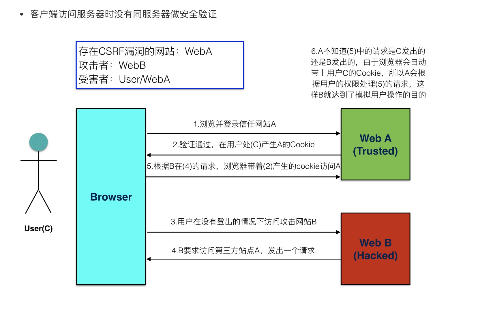

## CSRF

- 什么是csrf

  ​		CSRF全拼为Cross Site Request Forgery，译为跨站请求伪造。 CSRF指攻击者盗用了你的身份，以你的名义发送恶意请求。

  ​		包括：以你名义发送邮件，发消息，盗取你的账号，甚至于购买商品，虚拟货币转账......

  ​		造成的问题：个人隐私泄露以及财产安全。

  

- 原理

  ​		csrf要求发送post,put或delete请求的时候，是先以get方式发送请求，服务端响应时会分配一个随机字符串给客户端，客户端第二次发送post,put或delete请求时携带上次分配的随机字符串到服务端进行校验

  

- csrf 攻击示意图

  

- 防止 CSRF 攻击

  - 在客户端向后端请求界面数据的时候，后端会往响应中的 cookie 中设置 csrf_token 的值
- 在 Form 表单中添加一个隐藏的的字段，值也是 csrf_token在用户点击提交的时候，会带上这两个值向后台发起请求
  - 后端接受到请求，以会以下几件事件： 从 cookie中取出 csrf_token 从 表单数据中取出来隐藏的 csrf_token 的值 进行对比 如果比较之后两值一样，那么代表是正常的请求，如果没取到或者比较不一样，代表不是正常的请求，不执行下一步操作
  
  
  
- 使用

  - 配置文件 `settings.py`

    ```python
    MIDDLEWARE = [
    
        'django.middleware.security.SecurityMiddleware',
        'django.contrib.sessions.middleware.SessionMiddleware',
        'django.middleware.locale.LocaleMiddleware',
        'django.middleware.common.CommonMiddleware',
         # 默认是开启的
        'django.middleware.csrf.CsrfViewMiddleware',
        'django.contrib.auth.middleware.AuthenticationMiddleware',
        'django.contrib.messages.middleware.MessageMiddleware',
        'django.middleware.clickjacking.XFrameOptionsMiddleware',
    ]
    ```

  - urls.py

    ```python
    from django.urls import path,re_path
    from . import views
    urlpatterns = [
        path('teacher/',views.TeacherView.as_view()),
        path('student/',views.StudentView.as_view()),
        re_path(r'demo1/(?P<pk>\d+)/$',views.Demo1View.as_view()),
    ]
    ```

  - views.py

    ```python
    from django.shortcuts import render,redirect,HttpResponse
     
    # Create your views here.
    def login(request):
        if request.method == "GET":
            return render(request,'login.html')
        elif request.method == "POST":
            user = request.POST.get('user')
            pwd = request.POST.get('pwd')
            if user == 'root' and pwd == "123123":
                #生成随机字符串
                #写到用户浏览器cookie
                #保存在服务端session中
                #在随机字符串对应的字典中设置相关内容
                request.session['username'] = user
                request.session['islogin'] = True
                if request.POST.get('rmb',None) == '1':
                    #认为设置超时时间
                    request.session.set_expiry(10)
                return redirect('/index/')
            else:
                return render(request,'login.html')
     
    def index(request):
        #获取当前随机字符串
        #根据随机字符串获取对应的信息
        if request.session.get('islogin', None):
            return render(request,'index.html',{'username':request.session['username']})
        else:
            return HttpResponse('please login ')
     
    def logout(request):
        del request.session['username']
        request.session.clear()
        return redirect('/login/')
    ```

  - templates/login.html

    ```html
    <!DOCTYPE html>
    <html lang="en">
    <head>
        <meta charset="UTF-8">
        <title>Title</title>
    </head>
    <body>
        <form action="/login/" method="post">
          	
            <input type="text" name="user" />
            <input type="text" name="pwd" />
            <input type="checkbox" name="rmb" value="1" /> 10s免登录
            <input type="submit" value="提交" />
        </form>
    </body>
    </html>
```
    
    