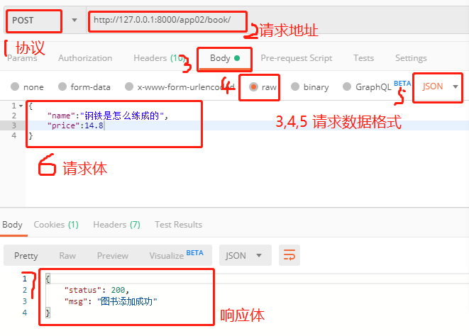

## 图书添加

- 模型

  ```python
  from django.db import models
  
  # 图书建模
  class Book(models.Model):
      # 图书名称
      name = models.CharField(max_length=32,unique=True)
      # 图书价格
      price = models.DecimalField(max_digits=9,decimal_places=2)
      # 图书添加时间，默认为当前时间
      addtime = models.DateTimeField(auto_now_add=True)
  
  ```

- 路由

  ```python
  urlpatterns = [
      path('book/',views.BookView.as_view()),
  ]
  ```

- 视图

  ```python
  from rest_framework.views import APIView
  from rest_framework.response import Response
  from . import models
  # 书籍
  class BookView(APIView):
  
      # 添加书籍
      def post(self,request):
          data = request.data
          # 进行图书名称非空验证
          name = data.get('name','')
          if not name:
              return Response({
                  "status":201,
                  "msg":"图书名称不能为空"
              })
          # 进行书籍唯一性验证
          book = models.Book.objects.filter(name=name).first()
          if book:
              return Response({
                  "status":202,
                  "msg":"图书名称已存在"
              })
          # 添加入库
          bookobj = models.Book.objects.create(**data)
          # 判断添加是否成功
          if bookobj:
              return Response({
                  "status":200,
                  "msg":"图书添加成功"
              })
          return Response({
              "status": 203,
              "msg": "图书添加失败"
          })
  ```

  

- 前端提交的数据

  

