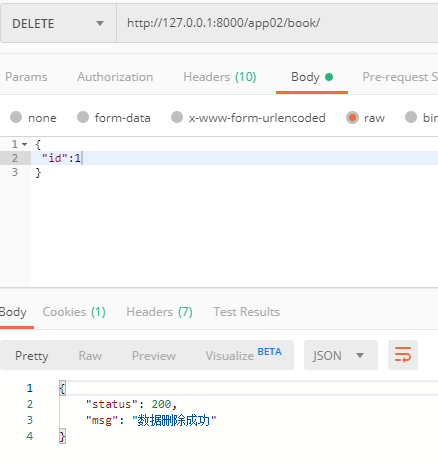

## 后台处理

- 模型

  ```python
  from django.db import models
  
  # 图书建模
  class Book(models.Model):
      # 图书名称
      name = models.CharField(max_length=32,unique=True)
      # 图书价格
      price = models.DecimalField(max_digits=9,decimal_places=2)
      # 图书添加时间，默认为当前时间
      addtime = models.DateTimeField(auto_now_add=True)
  ```

- 路由

  ```python
  urlpatterns = [
      path('book/',views.BookView.as_view()),
  ]
  ```

- 视图

  ```python
  from rest_framework.views import APIView
  from rest_framework.response import Response
  from . import models
  # 分页的类
  from django.core.paginator import Paginator
  # 书籍
  class BookView(APIView):
      # 删除图书
      def delete(self,request):
          id = request.data.get('id')
          book = models.Book.objects.filter(id=id).delete()
          if book[0]:
              return  Response({
                "status":200,
                "msg":"数据删除成功"
              })
          return Response({
              "status": 201,
              "msg": "数据删除失败"
          })
  ```

- 效果

  