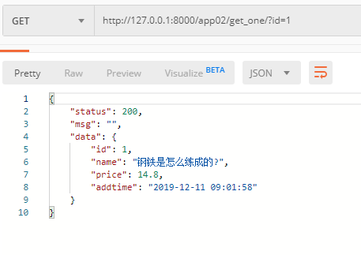

## 后台处理数据

- 模型

  ```python
  from django.db import models
  # 图书建模
  class Book(models.Model):
      # 图书名称
      name = models.CharField(max_length=32,unique=True)
      # 图书价格
      price = models.DecimalField(max_digits=9,decimal_places=2)
      # 图书添加时间，默认为当前时间
      addtime = models.DateTimeField(auto_now_add=True)
  ```

- 路由

  ```python
  urlpatterns = [
      path('book/',views.BookView.as_view()),
      path('get_one/',views.BookGetOneView.as_view()),
  ]
  ```

- 视图

  ```python
  from rest_framework.views import APIView
  from rest_framework.response import Response
  from . import models
  # 书籍
  class BookView(APIView):
      # 编辑数据信息
      def put(self,request):
          data = request.data
          id = data.pop('id')
          # 图书非空验证
          name = data.get('name','')
          if not name:
              return Response({
                  'status':201,
                  'msg':'图书名称已存在'
              })
          # 编辑图书
          flag = models.Book.objects.filter(id=id).update(**data)
          # 判断编辑是否成功
          if flag:
              return Response({
                  'status':200,
                  'msg':'编辑成功'
              })
          return Response({
              'status': 200,
              'msg': '编辑失败'
          })
      
      
  # 获取单条图书记录信息
  class BookGetOneView(APIView):
      def get(self,request):
          id = request.GET.get('id')
          bookobj = models.Book.objects.filter(id=id).first()
          data = {}
          if bookobj:
              data = {
                  "id":bookobj.id,
                  "name":bookobj.name,
                  "price":bookobj.price,
                  "addtime":bookobj.addtime.strftime('%Y-%m-%d %H:%M:%S'),
              }
          return Response({
              "status":200,
              "msg":"",
              "data":data
          })
  
  ```

  

- 结果显示

  - 获取单条数据

    

  - 编辑数据

  