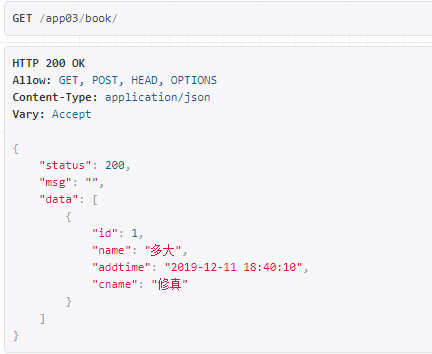

## 后台处理数据

- 模型

  ```python
  from django.db import models
  
  #　图书分类表
  class Category(models.Model):
      # 分类名称
      name = models.CharField(max_length=32,unique=True)
  
  #  图书表
  class Book(models.Model):
      # 图书名称
      name = models.CharField(max_length=32,unique=True)
      # 图书价格
      price = models.DecimalField(max_digits=9,decimal_places=2)
      # 图书添加时间
      addtime = models.DateTimeField(auto_now_add=True)
      # 外键
      cate = models.ForeignKey('Category',on_delete=models.CASCADE)
  ```

- 路由

  ```python
  urlpatterns = [
      path('book/',views.BookView.as_view()),
      path('cate/',views.CateView.as_view()),
  ]
  ```

- 视图

  ```python
  from rest_framework.views import APIView
  from rest_framework.response import Response
  from . import models
  # 图书
  class BookView(APIView):
      # 获取书籍
      def get(self,request):
          books = models.Book.objects.all()
          data = [{"id":i.id,"name":i.name,"addtime":i.addtime.strftime('%Y-%m-%d %H:%M:%S'),"cname":i.cate.name} for i in books]
          return Response({
              "status":200,
              "msg":"",
              "data":data
          })
  ```

- 效果

  