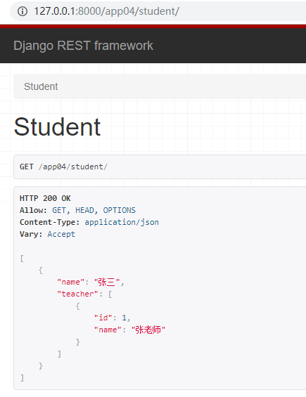

## 多对多序列化案例

- 模型 `models.py`

  ```python
  from django.db import models
  
  # 学生类
  class Student(models.Model):
      name = models.CharField(max_length=32)
  
      # 老师类
  class Teacher(models.Model):
      name = models.CharField(max_length=32)
      stu = models.ManyToManyField(to='Student',related_name='teacher')
  ```

- 路由 `urls.py`

  ```python
  urlpatterns = [
      path('student/',views.StudentView.as_view()),
      path('teacher/',views.TeacherView.as_view()),
  ]
  ```

- 序列化  `serializer.py`

  ```python
  from rest_framework import serializers
  from . import models
  
  # 老师序列化
  class TeacherSerializer(serializers.ModelSerializer):
      class Meta:
          model = models.Teacher
          fields = ('id','name')
  # 学生序列化
  class StudentSerializer(serializers.Serializer):
      name = serializers.CharField(max_length=32)
      teacher = TeacherSerializer(many=True,read_only=True)
  ```

- 视图 `views.py`

  ```python
  from rest_framework.views import APIView
  from rest_framework.response import Response
  from .serializer import *
  from . import models
  # 学生类
  class StudentView(APIView):
      # 查询所有的学生
      def get(self,request):
          studentobj = models.Student.objects.all()
          stu = StudentSerializer(studentobj, many=True)
          return Response(stu.data)
  ```

- 效果

  