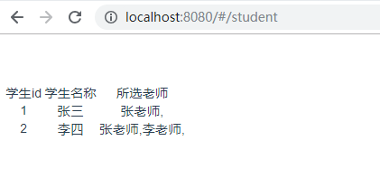

## vue前端

- 路由

  ```javascript
  import Vue from 'vue'
  import Router from 'vue-router'
  import student from '@/components/Student'
  Vue.use(Router)
  
  export default new Router({
    routes: [
      {
        path: '/student',
        name: 'student',
        component: student
      }
    ]
  })
  ```

- 代码

  ```vue
  <template>
      <div id='student'>
          <table>
              <tr>
                  <td>学生id</td>
                  <td>学生名称</td>
                  <td>所选老师</td>
              </tr>
  
              <tr v-for='i in students'>
                  <td>{{i.id}}</td>
                  <td>{{i.name}}</td>
                  <td>{{i.teacher | split_name}}</td>
              </tr>
          </table>
      </div>
  </template>
  <script>
  export default {
      name:'student',
      data() {
          return {
              students:[]
          }
      },
      mounted(){
          // 获取数据
          this.axios({
              url:'/api/app04/student/',
              method:'get'
          }).then(res=>{
              this.students = res.data.data;
          })
      },
      filters:{
          split_name:function(val){
              let teachers = "";
              for(var i in val){
                  console.log(val[i].name)
                  teachers += val[i].name+','
              }
              return teachers
          }
      }
  }
  </script>
  ```

- 显示

  