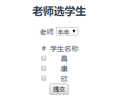

## vue前端

- 路由

  ```javascript
  import Vue from 'vue'
  import Router from 'vue-router'
  import teacher from '@/components/Teacher'
  Vue.use(Router)
  
  export default new Router({
    routes: [
      {
        path: '/teacher',
        name: 'teacher',
        component: teacher
      }
    ]
  })
  ```

- 代码

  ```vue
  <template>
      <div id='teacher'>
          <h2>老师选学生</h2>
          <p> 老师 
              <select v-model="tid">
                  <option v-for='i in teachers' :value="i.id">{{i.name}}</option>
              </select>
          </p>
          <table class="tabx">
              <tr>
                  <td>#</td>
                  <td>学生名称</td>
              </tr>
              <tr v-for='i in students'>
                  <td><input type='checkbox' :value='i.id' v-model="student_id"></td>
                  <td>{{i.name}}</td>
              </tr>
          </table>
          <button @click="sub">提交</button>
      </div>
  </template>
  <script>
  export default {
      name:'teacher',
      data() {
          return {
              tid:0,
              teachers:[],
              value:"0",
              students:[],
              student_id:[]
          }
      },
      mounted(){
          // 获取所有的老师
          this.axios({
              url:'/api/app05/teacher/',
              method:'get'
          }).then(res=>{
              this.teachers = res.data.data.teachers;
              this.students = res.data.data.students;
          })
      },
      methods:{
          sub:function(){
              let data = {
                  "id":this.tid,
                  'student_id':this.student_id
              }
              
              this.axios({
                  url:'/api/app05/teacher/',
                  method:'post',
                  data:data
              }).then(res=>{
                  if(res.data.status==200){
                      // 业务逻辑处理
                  }else{
                      alert(res.data.msg);
                  }
              })
          }
      }
  }
  </script>
  <style  scoped>
  .tabx{
      margin:0 auto;
  }
  </style>
  ```

  

- 效果

  