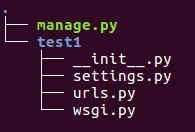

## 创建Django项目

- 创建Django项目

  - 命令 django-admin startproject 项目名称

- 项目结构

  - 如图

    

  - 目录说明：

    - manage.py：一个命令行工具，可以使你用多种方式对Django项目进行交互
    - 内层的目录：项目的真正的Python包
    - *_init* _.py：一个空文件，它告诉Python这个目录应该被看做一个Python包
    - settings.py：项目的配置
    - urls.py：项目的URL声明
    - wsgi.py：项目与WSGI兼容的Web服务器入口