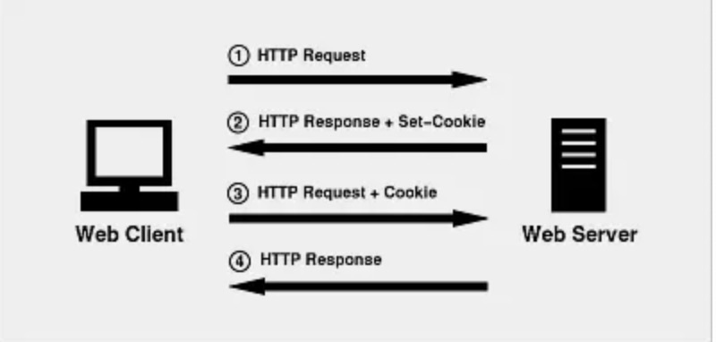

## cookie介绍与使用

- 什么是cookie

  ​		HTTP协议本身是无状态的。什么是无状态呢，即服务器无法判断用户身份。Cookie实际上是一小段的文本信息（key-value格式）。客户端向服务器发起请求，如果服务器需要记录该用户状态，就使用response向客户端浏览器颁发一个Cookie。客户端浏览器会把Cookie保存起来。当浏览器再请求该网站时，浏览器把请求的网址连同该Cookie一同提交给服务器。服务器检查该Cookie，以此来辨认用户状态。

- cookie的机制

  ​		当用户第一次访问并登陆一个网站的时候，cookie的设置以及发送会经历以下4个步骤：

  **客户端发送一个请求到服务器** --> **服务器发送一个HttpResponse响应到客户端，其中包含Set-Cookie的头部** --> **客户端保存cookie，之后向服务器发送请求时，HttpRequest请求中会包含一个Cookie的头部** --> **服务器返回响应数据**

  

  

- cookie的属性

  |   属性项   | 属性项介绍                                                   |
  | :--------: | ------------------------------------------------------------ |
  | NAME=VALUE | 键值对，可以设置要保存的 Key/Value，注意这里的 NAME 不能和其他属性项的名字一样 |
  |  Expires   | 过期时间，在设置的某个时间点后该 Cookie 就会失效             |
  |   Domain   | 生成该 Cookie 的域名，如 domain="[www.baidu.com](http://www.baidu.com/)" |
  |    Path    | 该 Cookie 是在当前的哪个路径下生成的，如 path=/wp-admin/     |
  |   Secure   | 如果设置了这个属性，那么只会在 SSH 连接时才会回传该 Cookie   |

- 例子

  - 设置cookie

    ```python
    def set_cookie(request):
      res = HttpResponse('ok')
      res.set_cookie('key','value')
    	return res
    ```

  - 获取cookie

    ```python
    def get_cookie(request):
      res = resquest.COOKIES.get('key')
      return HttpResponse(res)
    ```

  - 删除cookie

    ```python
    def del_cookie(request):
      res = HttpResponse('ok')
      res.delete_cookie('key')
      return res
    ```

  - 设置过期时间

    ```python
    def set_expir_cookie(request):
      res = HttpResponse('ok')
      res.set_cookie('key','value',max_age=60) # 单位是秒
      return res
    ```

    