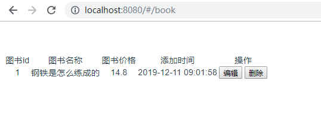

## vue 页面的显示

- 前端路由

  ```javascript
  import Vue from 'vue'
  import Router from 'vue-router'
  import book from '@/components/Book'
  
  Vue.use(Router)
  
  export default new Router({
    routes: [
      {
        path: '/book',
        name: 'book',
        component: book
      }
    ]
  })
  
  ```

- 前端代码

  ```vue
  <template>
      <div id='book'>
          <table>
              <tr>
                  <td>图书id</td>
                  <td>图书名称</td>
                  <td>图书价格</td>
                  <td>添加时间</td>
                  <td>操作</td>
              </tr>
  
              <tr v-for="i in books">
                  <td>{{i.id}}</td>
                  <td>{{i.name}}</td>
                  <td>{{i.price}}</td>
                  <td>{{i.addtime}}</td>
                  <td>
                      <button>编辑</button>
                      <button>删除</button>
                  </td>
              </tr>
          </table>
      </div>
  </template>
  <script>
  export default {
      name:'book',
      data() {
          return {
              books:[]
          }
      },
      mounted(){
          this.axios({
              url:'/api/app02/book/',
              method:'get'
          }).then(res=>{
              this.books = res.data.data;
          })
      }
  }
  </script>
  ```

- 显示结果

  