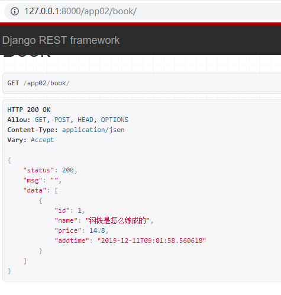

## 后台数据的处理

- 模型

  ```python
  from django.db import models
  
  # 图书建模
  class Book(models.Model):
      # 图书名称
      name = models.CharField(max_length=32,unique=True)
      # 图书价格
      price = models.DecimalField(max_digits=9,decimal_places=2)
      # 图书添加时间，默认为当前时间
      addtime = models.DateTimeField(auto_now_add=True)
  
  ```

- 路由

  ```python
  urlpatterns = [
      path('book/',views.BookView.as_view()),
  ]
  ```

- 视图

  ```python
  from rest_framework.views import APIView
  from rest_framework.response import Response
  from . import models
  # 书籍
  
  class BookView(APIView):
      # 获取图书相关信息
      def get(self,request):
          books = models.Book.objects.all()
          data =[{"id":i.id,"name":i.name,"price":i.price,"addtime":i.addtime.strftime('%Y-%m-%d %H:%M:%S')} for i in books]
          # 返回数据
          return Response({
              "status":200,
              "msg":"",
              "data":data
          })
  ```

- 获取的数据结构

  