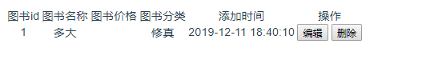

## vue页面显示

- 路由

  ```javascript
  import Vue from 'vue'
  import Router from 'vue-router'
  import book from '@/components/Book'
  Vue.use(Router)
  export default new Router({
    routes: [
      {
        path: '/book',
        name: 'book',
        component: book
      }
    ]
  })
  ```

- 代码

  ```python
  <template>
      <div id='book'>
          <table>
              <tr>
                  <td>图书id</td>
                  <td>图书名称</td>
                  <td>图书价格</td>
                  <td>图书分类</td>
                  <td>添加时间</td>
                  <td>操作</td>
              </tr>
  
              <tr v-for="i in books">
                  <td>{{i.id}}</td>
                  <td>{{i.name}}</td>
                  <td>{{i.price}}</td>
                  <td>{{i.cname}}</td>
                  <td>{{i.addtime}}</td>
                  <td>
                      <button @click="updatex(i.id)">编辑</button>
                      <button @click="delx(i.id)">删除</button>
                  </td>
              </tr>
          </table>
      </div>
  </template>
  <script>
  export default {
      name:'book',
      data() {
          return {
              books:[],
          }
      },
      mounted(){
          this.axios({
              url:'/api/app03/book/',
              method:'get'
          }).then(res=>{
              this.books = res.data.data;
          })
      },
      methods:{
          updatex:function(id){
              this.$router.push({
                  name:'updatebook',
                  params:{'id':id}
              })
          },
          delx:function(id){
              this.axios({
                  url:'/api/app02/book/',
                  method:'delete',
                  data:{"id":id}
              }).then(res=>{
                  if(res.data.status==200){
                      // 删除成功，重新请求数据
                      this.axios({
                          url:'/api/app02/book/',
                          method:'get'
                      }).then(res=>{
                          this.books = res.data.data;
                      })
                  }else{
                      alert(res.data.msg);
                  }
              })
          }
      }
  }
  </script>
  ```

  

- 显示

  